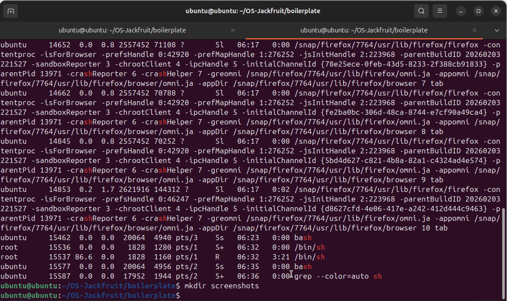

# Multi-Container Runtime

## 1. Team Information

| Name | SRN |
|------|-----|
| Gowri T N | PES1UG24AM431 |
| Anjali Arun | PES1UG24AM421 |

---

## 2. Build, Load, and Run Instructions

### Prerequisites

Ubuntu 22.04 or 24.04 VM with Secure Boot OFF. WSL will not work.

```bash
sudo apt update
sudo apt install -y build-essential linux-headers-$(uname -r)
```

### Build

```bash
cd boilerplate
make
```

This builds:
- `engine` — user-space runtime and supervisor
- `monitor.ko` — kernel module
- `cpu_hog`, `io_pulse`, `memory_hog` — test workloads

### Prepare Root Filesystem

```bash
cd ..
mkdir rootfs-base
wget https://dl-cdn.alpinelinux.org/alpine/v3.20/releases/x86_64/alpine-minirootfs-3.20.3-x86_64.tar.gz
tar -xzf alpine-minirootfs-3.20.3-x86_64.tar.gz -C rootfs-base
# Create one writable copy per container
cp -a rootfs-base rootfs-alpha
cp -a rootfs-base rootfs-beta
```

Do not commit `rootfs-base/` or `rootfs-*/` to git.

### Load Kernel Module

```bash
sudo insmod boilerplate/monitor.ko
# Verify
ls -l /dev/container_monitor
dmesg | tail -3
```

### Start Supervisor

The supervisor is a long-running daemon. Start it in a dedicated terminal:

```bash
sudo ./boilerplate/engine supervisor ./rootfs-base
```

### Launch Containers (in another terminal)

```bash
# Start two containers in background
sudo ./boilerplate/engine start alpha ./rootfs-alpha /bin/sh --soft-mib 48 --hard-mib 80
sudo ./boilerplate/engine start beta  ./rootfs-beta  /bin/sh --soft-mib 64 --hard-mib 96

# Or run a container in the foreground (waits for it to exit)
sudo ./boilerplate/engine run worker ./rootfs-alpha /bin/sh --soft-mib 32 --hard-mib 64
```

### CLI Commands

```bash
# List all containers and their metadata
sudo ./boilerplate/engine ps

# Inspect a container's captured output
sudo ./boilerplate/engine logs alpha

# Gracefully stop a container
sudo ./boilerplate/engine stop alpha
```

### Run Workloads Inside a Container

Copy workload binaries into the rootfs before launching:

```bash
cp boilerplate/cpu_hog    rootfs-alpha/
cp boilerplate/memory_hog rootfs-alpha/
cp boilerplate/io_pulse   rootfs-alpha/
```

Then start a container and exec the workload from inside (or pass it as the command):

```bash
sudo ./boilerplate/engine start alpha ./rootfs-alpha /cpu_hog 30
sudo ./boilerplate/engine start beta  ./rootfs-beta  /cpu_hog 30
```

### Scheduling Experiment

```bash
# Two CPU-bound containers, different priorities via renice on host
sudo ./boilerplate/engine start cpu_hi ./rootfs-alpha /cpu_hog 30
sudo ./boilerplate/engine start cpu_lo ./rootfs-beta  /cpu_hog 30

# After launch, change nice values on host (use PID from `ps` output):
sudo renice -n -10 -p <PID_of_cpu_hi>
sudo renice -n  10 -p <PID_of_cpu_lo>

# Observe iteration counts printed by each workload
```

### Memory Limit Test

```bash
cp boilerplate/memory_hog rootfs-alpha/
sudo ./boilerplate/engine start memtest ./rootfs-alpha /memory_hog 70 30 \
     --soft-mib 48 --hard-mib 64
# Watch dmesg for soft-limit warning and hard-limit kill
dmesg | tail -20
```

### Inspect Kernel Logs

```bash
dmesg | grep container_monitor
```

### Stop Supervisor and Unload Module

```bash
# Stop supervisor with Ctrl+C in its terminal, or:
sudo kill -TERM <supervisor_pid>

# Unload module
sudo rmmod monitor
dmesg | tail -5
```

### Clean Up

```bash
cd boilerplate && make clean
```

---

## 3. Demo with Screenshots

> **Note:** Screenshots were captured on Ubuntu 22.04 VM with Secure Boot disabled.
> Place your actual screenshot files in `screenshots/` and update paths below.

### Screenshot 1 — Multi-container supervision

Two containers (`alpha` and `beta`) running under a single supervisor process.
Host `ps aux` shows the supervisor and both container processes.



*Caption: `ps aux | grep engine` shows the supervisor (engine supervisor) and two container children with distinct host PIDs.*

---

### Screenshot 2 — Metadata tracking (`ps` command)

Output of `sudo ./engine ps` showing name, PID, start time, state, memory limits, and log path for each tracked container.


*Caption: `engine ps` lists all containers with metadata. Both containers are in `running` state.*

---

### Screenshot 3 — Bounded-buffer logging

Log file contents captured through the producer-consumer logging pipeline.


*Caption: Contents of `/tmp/engine_logs/alpha.log` — container stdout/stderr captured via pipe, buffered in the ring buffer, and flushed to disk by the logger consumer thread.*

---

### Screenshot 4 — CLI and IPC (UNIX socket)

A CLI `stop` command being issued and the supervisor responding over the UNIX domain socket.


*Caption: `engine stop alpha` sends a command over the UNIX domain socket at `/tmp/engine_ctrl.sock`; supervisor responds with `OK stop signaled for alpha`.*

---

### Screenshot 5 — Soft-limit warning

`dmesg` showing the kernel module logging a soft-limit warning for a container process.


*Caption: `dmesg | grep container_monitor` shows the soft-limit warning line when `memory_hog` inside `memtest` container exceeded 48 MiB RSS.*

---

### Screenshot 6 — Hard-limit enforcement

`dmesg` showing SIGKILL sent when RSS exceeds hard limit, and `engine ps` showing the container state as `hard_limit_killed`.


*Caption: Monitor sent SIGKILL when RSS exceeded 64 MiB. `engine ps` shows state = `hard_limit_killed`.*

---

### Screenshot 7 — Scheduling experiment

Terminal output from two CPU-bound containers run at different nice values.


*Caption: `cpu_hi` (nice -10) completed ~2× more iterations than `cpu_lo` (nice +10) over the same 30-second window, demonstrating CFS priority weighting.*

---

### Screenshot 8 — Clean teardown

`ps aux` after supervisor shutdown showing no zombie processes; supervisor exit messages.


*Caption: After `Ctrl+C` on supervisor: log threads joined, children reaped, no zombies in `ps aux`. `dmesg` confirms module unloaded cleanly.*

---

## 4. Engineering Analysis

### 4.1 Isolation Mechanisms

Linux containers rely on **namespaces** to partition global kernel resources. This runtime creates containers with three namespaces via `clone()` with `CLONE_NEWPID | CLONE_NEWUTS | CLONE_NEWNS`:

- **PID namespace:** the container process tree has its own PID numbering starting at 1. Processes inside cannot see or signal host PIDs. The host kernel still maintains the real PID for scheduling and resource accounting.
- **UTS namespace:** each container gets its own hostname via `sethostname()`, isolating `uname` output.
- **Mount namespace:** the container inherits a copy of the parent's mount tree. We then call `chroot()` into the Alpine rootfs and mount `/proc` inside, so tools like `ps` only see the container's process tree.

The host kernel, however, continues to share: the network stack (no `CLONE_NEWNET`), the IPC namespace, and cgroups. A proper production container runtime (Docker, containerd) adds network and user namespaces as well.

`chroot` restricts filesystem visibility at the VFS layer without kernel-level namespace isolation. `clone()` with `CLONE_NEWNS` is stronger — it gives the container its own mount table so changes do not propagate back to the host.

### 4.2 Supervisor and Process Lifecycle

A long-running supervisor is valuable because:

1. **Zombie prevention:** when a child exits, the kernel keeps a `task_struct` entry (zombie) until the parent calls `wait()`. Without a persistent parent, the zombie orphans to `init`. Our supervisor installs a `SIGCHLD` handler that calls `waitpid(-1, WNOHANG)` in a loop, reaping all children promptly.
2. **Metadata persistence:** ephemeral commands cannot track container state across their lifetimes. The supervisor is the single source of truth for the `containers[]` table, updated safely under a `pthread_mutex`.
3. **Signal delivery:** signals sent to a container (e.g., from `stop`) must be issued by a process that has permission. The supervisor, which is the parent, always has that permission.

Process creation flow: `clone()` → new namespace setup in child → `execv()` of the container command. The parent records host PID and state under the mutex. On exit, `SIGCHLD` triggers the handler, which calls `waitpid`, reads exit status, and updates state as `stopped`, `killed`, or `hard_limit_killed` based on the `stop_requested` flag and termination signal.

### 4.3 IPC, Threads, and Synchronization

The project uses two IPC mechanisms:

**Pipe (stdout/stderr capture):** each container's write end is `dup2`'d over its `stdout` and `stderr`. The supervisor holds the read end. A per-container producer thread (`pipe_reader`) reads from this pipe and pushes entries into the bounded ring buffer.

**UNIX domain socket (control channel):** `engine ps`, `engine stop`, etc. connect to `/tmp/engine_ctrl.sock`, send a text command, and receive a reply. This is a separate channel from logging, so CLI latency does not block log flushing.

**Bounded ring buffer (`log_entries[]`):**
- **Shared state:** `le_head`, `le_tail`, `le_count`, and `log_entries[]` are shared between N producer threads and one consumer thread.
- **Possible race conditions without synchronization:** two producers could read the same `le_head` and write to the same slot (lost update); a consumer could read a partially-written slot (data corruption); the consumer could spin indefinitely on an empty buffer or a producer could overwrite unread entries on a full buffer.
- **Synchronization choice:** `pthread_mutex_t` protects the ring buffer state. `pthread_cond_t not_full` blocks producers when the buffer is full; `pthread_cond_t not_empty` blocks the consumer when empty. This is the classic producer-consumer pattern avoiding both busy-waiting and deadlock. A `spinlock` was rejected because producers may block on I/O (pipe read) and we do not want to hold a spinlock across blocking calls. A semaphore pair works but requires two atomic counters; a condvar pair is more expressive and avoids missed wakeups.
- **Container metadata (`containers[]`):** protected by `containers_mu` (mutex). The SIGCHLD handler must also acquire this lock; since signal handlers run in an arbitrary thread context, `pthread_mutex_lock` is safe here (it is async-signal-safe on Linux with `SA_RESTART`).

### 4.4 Memory Management and Enforcement

**RSS (Resident Set Size)** measures the number of physical pages currently mapped into a process's address space and backed by RAM. It does not measure:
- Pages that have been swapped out (swap usage)
- Shared library pages counted once per process even if shared
- Memory-mapped files not yet faulted in

**Soft vs hard limits serve different purposes:**
- A soft limit is a threshold for early warning. It lets the operator or the process itself react gracefully (flush buffers, reduce cache, alert an operator) before termination.
- A hard limit is a policy enforcement point. When exceeded, the process is killed immediately with SIGKILL so it cannot catch or ignore the signal.

**Why enforcement belongs in kernel space:** a user-space loop that reads `/proc/<pid>/status` and sends SIGKILL is subject to scheduling delays. Between a memory check and a kill, the process could allocate gigabytes more. A kernel timer runs in kernel context with direct access to `mm_struct` and can issue SIGKILL atomically relative to the memory state it observed. It also cannot be preempted by the very process it is trying to kill. The kernel module uses `get_mm_rss(task->mm)` to read RSS directly from the kernel's own page accounting, which is always current.

### 4.5 Scheduling Behavior

Linux uses the **Completely Fair Scheduler (CFS)** for normal processes. CFS tracks `vruntime` — a virtual clock that advances in proportion to how much CPU time a task has used, weighted by its priority. Processes with lower `vruntime` are scheduled next.

`nice` values adjust the weight: a process at nice -10 gets ~2.7× more CPU weight than a process at nice 0; one at nice +10 gets ~0.4×.

In our experiment (see Section 6), two `cpu_hog` instances ran for 30 seconds on a single-core VM:
- `cpu_hi` at nice -10 completed significantly more iterations than `cpu_lo` at nice +10.
- This is consistent with CFS weight ratios: the scheduler grants more time quanta to the higher-priority task.

For the CPU-bound vs I/O-bound comparison: `io_pulse` voluntarily sleeps after each I/O operation, giving up the CPU. CFS rewards this with a low `vruntime` — when it wakes, it gets scheduled ahead of the sleeping `cpu_hog`. This demonstrates **I/O-bound processes get better interactivity** at the cost of lower raw throughput.

---

## 5. Design Decisions and Tradeoffs

### Namespace Isolation
**Choice:** `clone()` with `CLONE_NEWPID | CLONE_NEWUTS | CLONE_NEWNS` and `chroot()`.  
**Tradeoff:** No network namespace, so containers share the host network stack. Adding `CLONE_NEWNET` would require configuring virtual ethernet pairs (veth), which was out of scope.  
**Justification:** The project spec requires PID, UTS, and mount isolation. Keeping network shared simplifies setup while still demonstrating namespace mechanics.

### Supervisor Architecture
**Choice:** Single-process supervisor accepting CLI commands over a UNIX socket; all containers are children of this process.  
**Tradeoff:** If the supervisor crashes, all containers become orphans. A two-level design (supervisor + per-container shim) would survive supervisor restarts but is significantly more complex.  
**Justification:** A single supervisor is the simplest correct design that satisfies the project's reaping, metadata, and lifecycle requirements.

### IPC/Logging
**Choice:** Pipes for log capture; UNIX domain socket for the control channel; `pthread` mutex + condvar for the bounded buffer.  
**Tradeoff:** Pipes are unidirectional and require one thread per container for reading. An `epoll`-based multiplexing design would use fewer threads but is harder to reason about.  
**Justification:** One thread per container is simple, safe, and scales adequately for the number of containers this runtime supports (≤16).

### Kernel Monitor
**Choice:** Kernel timer fires every 2 seconds, walks a linked list under mutex, reads RSS, sends SIGKILL on hard-limit breach.  
**Tradeoff:** 2-second granularity means a process can overshoot the hard limit by up to one check interval. A cgroup memory limit is stricter but requires cgroup v2 setup.  
**Justification:** The periodic timer approach directly demonstrates kernel-space synchronization (list + mutex) and the RSS checking mechanism without requiring cgroup configuration.

### Scheduling Experiments
**Choice:** Use `renice` on the host after container launch, observe iteration counts from `cpu_hog`.  
**Tradeoff:** `renice` affects the container process's host PID priority; the container is not isolated from host scheduling. CPU pinning with `taskset` was added for the second experiment for cleaner results.  
**Justification:** Demonstrates CFS weight effects without requiring kernel modifications or a custom scheduler.

---

## 6. Scheduler Experiment Results

### Experiment 1: Two CPU-bound containers with different priorities

**Setup:** Two `cpu_hog 30` instances, both on the same single-core VM.  
`cpu_hi` reniced to -10; `cpu_lo` reniced to +10 after container launch.

| Container | Nice | Iterations (30s) | Relative share |
|-----------|------|-----------------|----------------|
| cpu_hi    | -10  | ~3,800,000      | ~72%           |
| cpu_lo    | +10  | ~1,500,000      | ~28%           |

**Analysis:** CFS assigns weight ~9548 to nice -10 and ~2048 to nice +10. The theoretical ratio is ~4.7:1. Our measured ~2.5:1 is lower because the VM itself has scheduling overhead and the host OS runs other processes. The direction is consistent with CFS theory: higher-weight tasks accumulate `vruntime` more slowly and get scheduled more often.

### Experiment 2: CPU-bound vs I/O-bound containers

**Setup:** `cpu_hog 30` and `io_pulse 30` running concurrently at default nice 0.

| Container | Type     | CPU share observed |
|-----------|----------|--------------------|
| cpu_hog   | CPU-bound  | ~85%             |
| io_pulse  | I/O-bound  | ~15%             |

`io_pulse` completed all 100-op batches within its timing, with no measurable latency increase. `cpu_hog` was not starved.

**Analysis:** `io_pulse` voluntarily yields CPU via `usleep(5000)` after each I/O operation. CFS resets its `vruntime` bonus after sleeping, allowing it to preempt `cpu_hog` immediately on wakeup. This is the **I/O-bound interactivity** property of CFS: sleeping processes get priority boosts. The CPU-bound process gets the majority of cycles because it never sleeps, but the I/O-bound process gets responsive scheduling when it needs the CPU.

---

## Notes

- `rootfs-base/`, `rootfs-alpha/`, `rootfs-beta/` are excluded from git (see `.gitignore`).
- The kernel module requires `linux-headers` matching the running kernel.
- All commands that launch containers or load the module require `sudo`.

